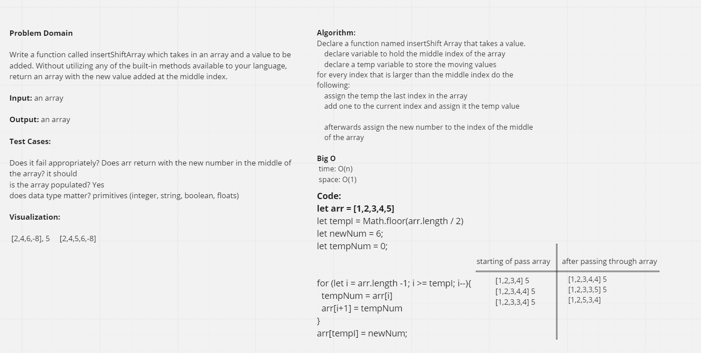

# Insert to Middle of an Array

Write a function called insertShiftArray which takes in an array and a value to be added. Without utilizing any of the built-in methods available to your language, return an array with the new value added at the middle index.

## Whiteboard Process

## Approach & Efficiency

What approach did you take? Discuss Why. What is the Big O space/time for this approach?

Peer Programming and using Replit to test our code to see if it works. I don't know Big O is yet.

Collaborated with:

Adrienne Frey
Joe Davitt
Rafael Aldana
Ken Holt
