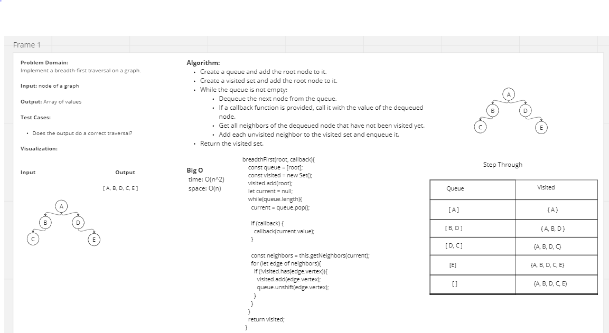

# Graphs

Implement your own Graph. The graph should be represented as an adjacency list, and should include the following methods:

- add node
  - Arguments: value
  - Returns: The added node
  - Add a node to the graph
- add edge
  - Arguments: 2 nodes to be connected by the edge, weight (optional)
  - Returns: nothing
  - Adds a new edge between two nodes in the graph
  - If specified, assign a weight to the edge
  - Both nodes should already be in the Graph
- get nodes
  - Arguments: none
  - Returns all of the nodes in the graph as a collection (set, list, or similar)
  - Empty collection returned if there are no nodes
- get neighbors
  - Arguments: node
  - Returns a collection of edges connected to the given node
  - Include the weight of the connection in the returned collection
  - Empty collection returned if there are no nodes
- size
  - Arguments: none
  - Returns the total number of nodes in the graph
  - 0 if there are none
  Write the following method for the Graph class:
- breadth first traversal
  - Arguments: Node
  - Return: A collection of nodes in the order they were visited.
  - Display the collection

## Approach & Efficiency

The Big O for this depends which method is being performed

## White Board

## Solution

`run npm test` Shows successful tests for this file
