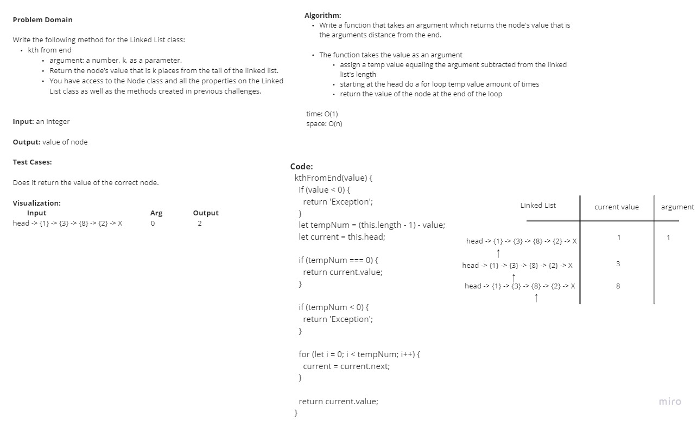

# Singly Linked List

Introduction to linked lists

## Challenge
Node
Create a Node class that has properties for the value stored in the Node, and a pointer to the next Node.
Linked List
Create a Linked List class
Within your Linked List class, include a head property.
Upon instantiation, an empty Linked List should be created.
The class should contain the following methods
insert
Arguments: value
Returns: nothing
Adds a new node with that value to the head of the list with an O(1) Time performance.
includes
Arguments: value
Returns: Boolean
Indicates whether that value exists as a Node’s value somewhere within the list.
to string
Arguments: none
Returns: a string representing all the values in the Linked List, formatted as:
"{ a } -> { b } -> { c } -> NULL"

### Stack

- Create a Stack class that has a top property. It creates an empty Stack when instantiated.
- This object should be aware of a default empty value assigned to top when the stack is created.
- The class should contain the following methods:

  - Push

    - Arguments: value
        - adds a new node with that value to the top of the stack with an O(1) Time performance.
  - Pop
    - Arguments: none
        - Returns: the value from node from the top of the stack
        - Removes the node from the top of the stack
        - Should raise exception when called on empty stack
  - Peek
    - Arguments: none
        - Returns: Value of the node located at the top of the stack
        - Should raise exception when called on empty stack
  - is empty
    - Arguments: none
        - Returns: Boolean indicating whether or not the stack is empty.
### Queue
- Create a Queue class that has a front property. It creates an empty Queue when instantiated.
- This object should be aware of a default empty value assigned to front when the queue is created.
- The class should contain the following methods:
  - enqueue
    - Arguments: value
        - adds a new node with that value to the back of the queue with an O(1) Time performance.
  - dequeue
    - Arguments: none
      - Returns: the value from node from the front of the queue
      - Removes the node from the front of the queue
      - Should raise exception when called on empty queue
  - peek
    - Arguments: none
      - Returns: Value of the node located at the front of the queue
      - Should raise exception when called on empty stack
  - is empty
    - Arguments: none
      - Returns: Boolean indicating whether or not the queue is empty

## Approach & Efficiency

Mob Programming and test our code to see if it works. I don't know what Big O is yet.

## API

Insert - Insterts a new Node in the Linked List
toString - Returns a string representing the inserted Node
Includes - Determine whether the value is in the Linked List

Collaborated with:

Adrienne Frey
Joe Davitt
Ken Holt
Jeremy Cleland
Brandon Perard
Tyler Bennett
Ty Aponte
Martin Hansen

