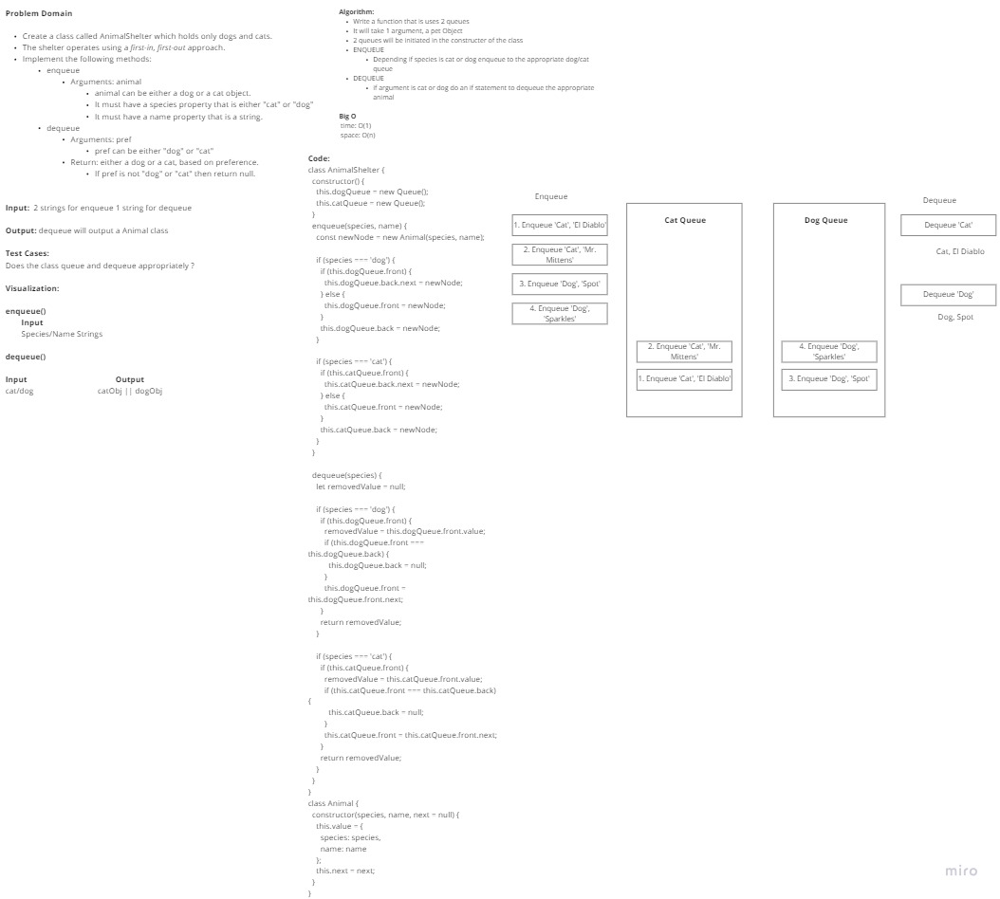

# Stacks and Queues

Introduction to linked lists

## Challenge

Create stacks and queues for various Code Challenges

### Stack

- Create a Stack class that has a top property. It creates an empty Stack when instantiated.
- This object should be aware of a default empty value assigned to top when the stack is created.
- The class should contain the following methods:

  - Push

    - Arguments: value
      - adds a new node with that value to the top of the stack with an O(1) Time performance.
  - Pop
    - Arguments: none
      - Returns: the value from node from the top of the stack
      - Removes the node from the top of the stack
      - Should raise exception when called on empty stack
  - Peek
    - Arguments: none
      - Returns: Value of the node located at the top of the stack
      - Should raise exception when called on empty stack
  - is empty
    - Arguments: none
      - Returns: Boolean indicating whether or not the stack is empty.

### Queue

- Create a Queue class that has a front property. It creates an empty Queue when instantiated.
- This object should be aware of a default empty value assigned to front when the queue is created.
- The class should contain the following methods:
  - enqueue
    - Arguments: value
      - adds a new node with that value to the back of the queue with an O(1) Time performance.
  - dequeue
    - Arguments: none
      - Returns: the value from node from the front of the queue
      - Removes the node from the front of the queue
      - Should raise exception when called on empty queue
  - peek
    - Arguments: none
      - Returns: Value of the node located at the front of the queue
      - Should raise exception when called on empty stack
  - is empty
    - Arguments: none
      - Returns: Boolean indicating whether or not the queue is empty

## Approach & Efficiency

Mob Programming and test our code to see if it works. I don't know what Big O is yet.

Collaborated with:

Adrienne Frey
Joe Davitt
Ken Holt
Jeremy Cleland
Brandon Perard
Tyler Bennett
Ty Aponte
Martin Hansen

