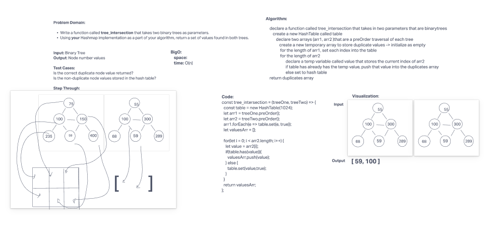

# Tree Intersection

Write a function called tree_intersection that takes two binary trees as parameters.

Using your Hashmap implementation as a part of your algorithm, return a set of values found in both trees.

## Approach & Efficiency

bigO(n)

## Solution

For tests: npm run test

## White Board

## Collaborators

- Adrienne Frey
- Joe Davitt
- Martin Hansen
