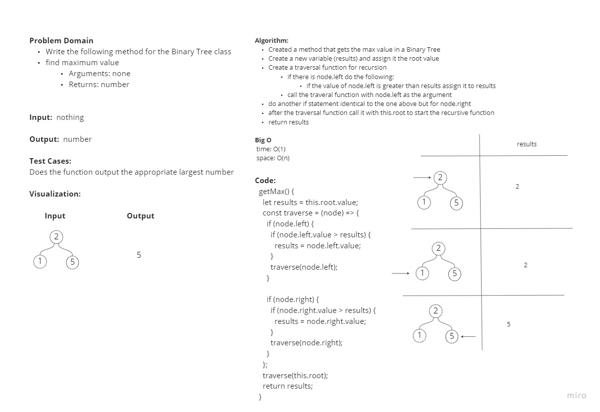

# Trees

Create a Binary Tree and Binary Search Tree with various methods

## Challenge

- Node
  - Create a Node class that has properties for the value stored in the node, the left child node, and the right child node.
- Binary Tree
  - Create a Binary Tree class
    - Define a method for each of the depth first traversals:
      - pre order
      - in order
      - post order
      - get Max
    - Each depth first traversal method should return an array of values, ordered appropriately.
- Binary Search Tree
  - Create a Binary Search Tree class
    - This class should be a sub-class (or your languages equivalent) of the Binary Tree Class, with the following additional methods:
    - Add
      - Arguments: value
      - Return: nothing
      - Adds a new node with that value in the correct location in the binary search tree.
    - Contains
      - Argument: value
      - Returns: boolean indicating whether or not the value is in the tree at least once.

## Approach & Efficiency

- Binary Tree & BST
  - All time complexity is O(log n) and space complexity is O(n)

## API

- Binary Tree Class
  - preOrder() - Pre Order depth first traversal
  - inOrder() - In Order depth first traversal
  - postOrder() - Post Order depth first traversal
  - getMax() - Get max value within the tree
- Binary Search Tree subclass
  - add(value) - Adds a value to the tree
  - contains(value) - Searches for a value in the tree

## Approach & Efficiency

Mob Programming and test our code to see if it works.

Collaborated with:

John Chavez

